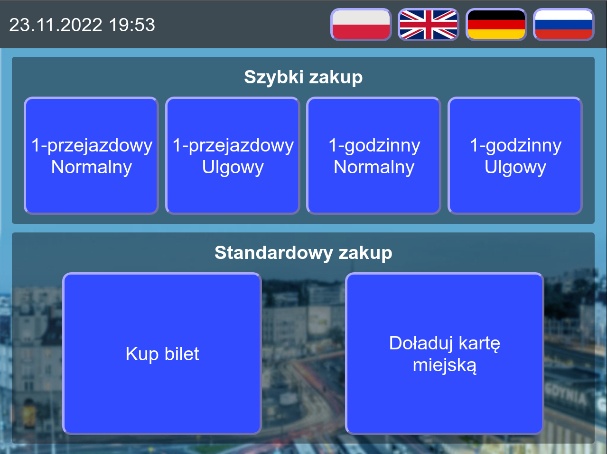

# wimwt

A concept of a GUI for ZKM Gdynia's ticket machines (non-existent as of 2021). A project created for Wizualizacja i Multimedia w Technice (Visualization and Multimedia in Technology) subject in a shape of an interactive web application based on HTML5, CSS3 and JavaScript.

## Screenshot

